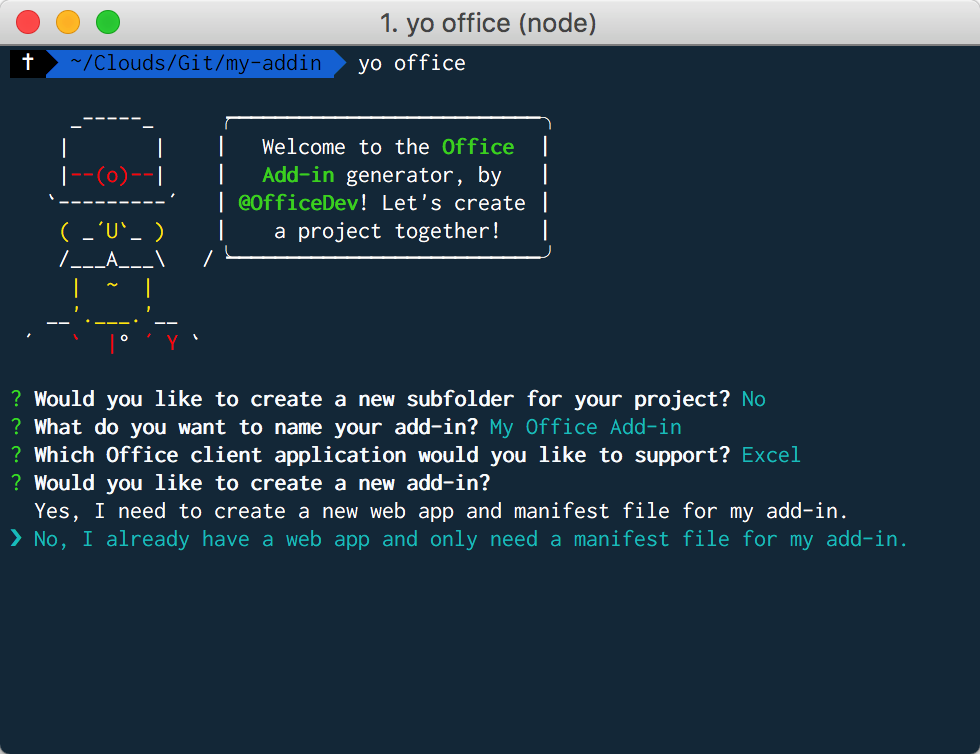
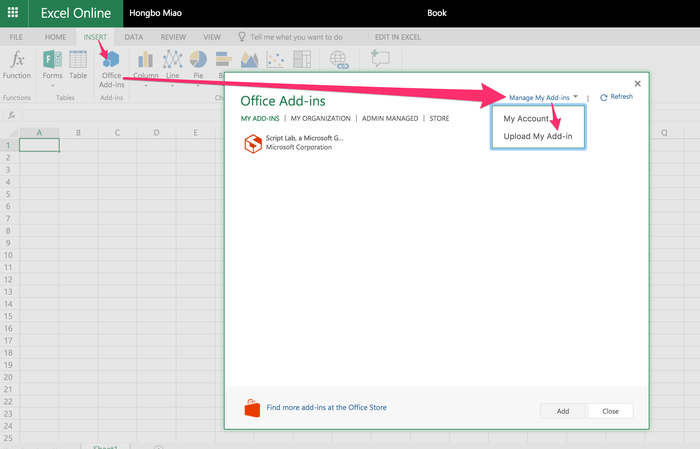

# Excel Add-ins

# Overview

## What is Office Add-in

An Office add-in can add features and functions to Excel, Word, PowerPoint, Outlook, OneNote, etc. The add-ins in [Office Store](https://store.office.com/en-us/appshome.aspx) can give you some ideas what an add-in can be done.

## Why Office.js

There are many ways to build an add-in such as VBA, VSTO, and so on. Why do we provide a new way Office.js?

- Cross platform. If you build an add-in using Office.js. It will not only support Windows, Mac, but also iOS, Online version Office.
- Single sign in. It integrate easily with users' Office 365 account.
- Centralized deployment and distribution. It helps the admin in the organization easily deploy and apply it to all employees in the corganization.
- Now we have an [Office store](https://store.office.com/en-us/appshome.aspx). You can submit your add-in in the store. It helps users find the add-in they want.
- An add-in built by Office.js is using the web technology. It is just a web app. Use any library you want! 

> For VSTO, VBA development, please check [here](https://msdn.microsoft.com/en-us/library/fp179694.aspx).

# Quick Start

An add-in built by Office.js has two parts: the web app and a manifest file. The manifest file tells Office where should find the app.

Let's see a simple app which changes the color of the range in Excel.

```typescript
Excel.run(context => {
  const range = context.workbook.getSelectedRange();
  range.format.fill.color = 'blue';

  return context.sync();
});
```

`Excel.run()` executes a batch script that performs actions on the Excel object model. The batch commands include definitions of local JavaScript proxy objects and `sync()` methods that synchronize the state between local and Excel objects and promise resolution.

The `run()` method takes in RequestContext and returns a promise (typically, just the result of context.sync()).

> The advantage of batching requests in `Excel.run()` is that when the promise is resolved, any tracked range objects that were allocated during the execution will be automatically released. It is possible to run the batch operation outside of the `Excel.run()`. However, in such a scenario, any range object references needs to be manually tracked and managed.

The `sync()` method, available on the request context, synchronizes the state between JavaScript proxy objects and real objects in Excel by executing instructions queued on the context and retrieving properties of loaded Office objects for use in your code. This method returns a promise, which is resolved when synchronization is complete.

## Playground

Let's install the playground for Ofifce.js - [Script Lab](https://store.office.com/en-us/app.aspx?assetid=WA104380862). Actually, Script Lab itslef is also an add-in.

Once installing the Script Lab, create a new project.

Change codes in the **Template** to

```html
<button id="color">Color Me</button>
```

Then change codes in the **Script** to

```typescript
$("#color").click(changeColor);

function changeColor() {
    Excel.run(context => {
      const range = context.workbook.getSelectedRange();
      range.format.fill.color = 'blue';

      return context.sync();
    });
}
```

Select a range in Excel and click "Color Me" button. If you see the color changes to blue.

Congratulations you just finish your first add-in for Excel!

## Build an Add-in with React

### Step 1. Generate the app

1. Generate the React project using **Create React App**.

	If you never install [Create React App](https://github.com/facebookincubator/create-react-app) before, first install it globally.
	
	```bash
	npm install -g create-react-app
	```
	
	Then generate your React app by
	
	```bash
	create-react-app my-addin
	```

2. Generate the manifest file using **YO Office**.

	If you never install [Yeoman](https://github.com/yeoman/yo) and [YO Office](https://github.com/OfficeDev/generator-office) before, first install them globally.

	```bash
	npm install -g yo generator-office
	```

	Go to your app folder.
	
	```bash
	cd my-addin
	```
	
	
	Generate the manifest file following the steps in the screenshot below.
	
	```bash
	yo office
	```

	
	
	You should be able to see your manifest file with the name ends with **manifest.xml**. 

	
	

### Step 2. Run

1. To run the add-in, you need side-load the add-in within the Excel application. The section below describes the way of side-loading of manifest file in different platforms.

    - Windows
    
    	Follow [this tutorial](https://dev.office.com/docs/add-ins/testing/create-a-network-shared-folder-catalog-for-task-pane-and-content-add-ins).

    - macOS

		Move the manifest file to the folder `/Users/{username}/Library/Containers/com.microsoft.Excel/Data/Documents/wef` (if the folder does not exist, create one)

    - Excel Online

		Click **Upload My Add-in** button to upload the manifest file.

		


2. Run the dev server though the terminal.

    - Windows
    
        ```bash
        set HTTPS=true&&npm start
        ```
    
    -  macOS
    
        ```bash
        HTTPS=true npm start
        ```

3. Open Excel and click your add-in to load.

